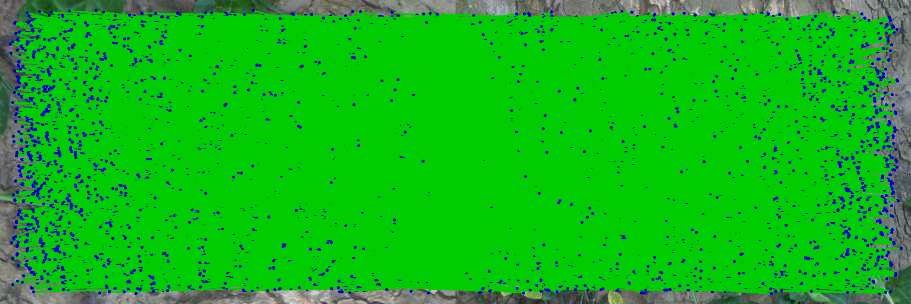
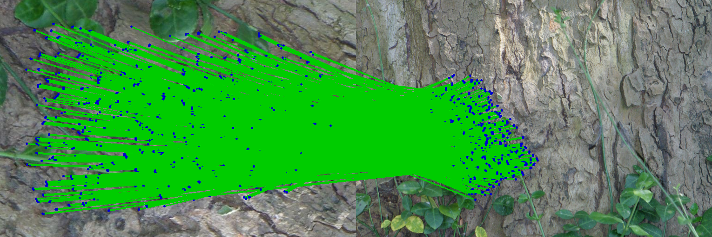
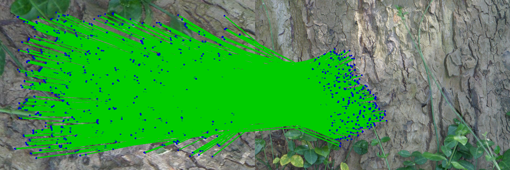

# GlcMatch: Global and Local Constraints for Reliable Keypoint Matching

## Demo
```
glcmatch [image1 path] [image2 path] [putative matches path] [core matches path] [output file path]
```


## Example

Putative Matches


Core Matches


True Matches
